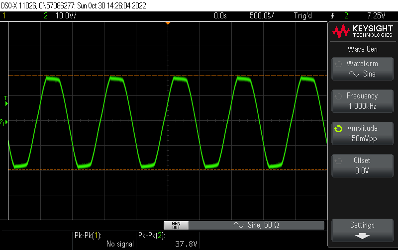

# Mesa Boogie 20/20 Dyna-Watt

Characterization of a Mesa 20/20 power amplifier into an 8ohm resistive load.

The Mesa 20/20 is a class AB rack-mountable el84-based power amplifier originally made for guitars.

The "Dyna-Watt" [patent](https://patents.google.com/patent/US4713624A/en) describes a sort of soft-limiting or compression that occurs naturally due to power supply sag to the power tubes.

Measurements taken with a Keysight DSOX1102G and a Micsig DP10007 differential probe.

The differential probe is connected to two sense leads soldered into a 1/4" phono along with the load:

Yes, thats an owl hot-pad from my kitchen.

Note, you need a differential probe to do this kind of measurement safely.  I learned this the hard way with a Crown XLS-202.  A standard scope probe isnt just + and -, it is + and ground.

Unless stated otherwise, frequency response is measured from 20hz-100khz, with an input of 100mv peak-to-peak:

Volume knob on amplifier is always full.  100mv is just about the max input before the output starts to clip.

## control frequency response

This is the basic frequency repsonse of the amplifier with the presence control at its minimum.
The amplifier at this time is unmodified and has what I assume are its original mesa tubes.

Channel A:

Channel B:

Note the variance between the two channels.  As we will see later, this variance is larger than even some tube combinations.

## presence control

The presence control appears to be centered on around 25khz.

Again, here is minimum presence:

and here is maximum presence:

While it has a 25khz peak, its effect can be seen from ~6khz up.  I found the flattest response to be with the knob at 9 o'clock.

## sine-wave performance

Here are sine waves from 1khz, 100hz, and 30hz.  I chose 30hz because this is about the lowest frequency that I still expect to get from high-end speakers without a proper subwoofer.

The waveform starts to fall apart at around 50hz.

## square-wave performance

Here are square waves from 1khz, 100hz, and 30hz.

## clipping characteristic

Here is 1khz being incrementally overdriven:

## tube swapping

Here are a handful of different tubes in place of v1, which is shared by both channels.
A nice way to compare these is to "open image in new tab" and scroll between the tabs.

Mesa 12ax7:

JJ 12ax7, new production:

GE 12ax7:

RCA 12ax7:

RCA 12au7, lower gain than ax7:

GE 12bz7, higher gain than ax7:

The takeaway here for me is the fact that the difference between the two channels with all original tubes was greater than that of some of the different 12ax7s shown here, at least in frequency response.

Clipping characteristcs looked largely unchanged as well, though I didnt capture this for all the tubes.  In the future I'd like to get my hands on a set of "low power" JJ el844 power tubes and do a deep-dive into the performance of those vs standard el84s.

## cathode bypass

I picked up this amplifier to use for hifi, and am after the flattest and lowest response I can coerce from it.  On forum threads discussing the 20/20 you will often come across the "deep mod", which supposedly smoothes out the low-mid hump.

What this modification is is removing v1's cathode bypass caps which act as high-pass filters.  They have a relatively low capacitance of 1uf, resulting in the amp's 100-200hz rolloff.  I read a value of 22uf-50uf should lower this to sub-20hz.  I plan to measure this.
